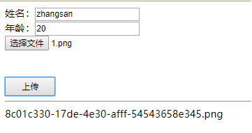

# axios+springboot实现文件上传（文件以及表单）、下载（post/get方式）

 spring boot 的文件上传下载与 spring mvc的基本一致，只需注意一些配置即可。

文章将介绍：

上传：单文件上传方式、多文件上传方式、文件与表单数据一起提交的方式

下载：get方式、post方式


## 基础配置：

需要文件上传的必定是web项目，web依赖必不可少：

```xml
<!-- web -->
<dependency>
    <groupId>org.springframework.boot</groupId>
    <artifactId>spring-boot-starter-web</artifactId>
</dependency>
```

另外，我们需要在application.properties中配置以下信息：

```properties
### 文件上传相关
# 单个文件上传最大值
spring.servlet.multipart.max-file-size=5MB
# 总文件上传最大值
spring.servlet.multipart.max-request-size=5MB
# multipart上传文件
spring.servlet.multipart.enabled=true
# 上传文件的临时目录
#spring.servlet.multipart.location=
# multipart上传文件时懒加载
#spring.servlet.multipart.resolve-lazily=false
```


## 一、文件上传

### 1.单文件上传

①.前端上传页面：

（上传文件需要将请求头设为multipart/form-data，multipart表单和普通表单的不同，它会把表单分割成块，表单中的每个字段对应一个块，每个块都有自己的数据类型即Content-Type。然后利用FormData对象将数据包装。最后通过axios发送到后台指定的Controller）

```html
<!DOCTYPE html>
<html lang="en">
<head>
    <meta charset="UTF-8">
    <title>Title</title>
</head>
<body>
<div id="uploadApp">

    <h2>上传</h2>
    <input type="file"/>
    <br/><br/><br/>
    <button @click="goUpload" style="width: 80px;height: 30px;">上传</button>
    

    <hr/>
    <span>{{ saveFileName }}</span>    
</div>

<script src="/js/public/vue.min.js"></script>
<script src="/js/public/axios.min.js"></script>

<script>
    let app = new Vue({
        el: '#uploadApp',
        data: {
            saveFileName: ''
        },
        methods: {
            //图片校验
            verifyFile: (file) => {
                if (file == null) {
                    alert('请上传图片！');
                    return false;
                }
                let img_regexp = /^image\/\w+/g;
                if (!img_regexp.test(file.type)) {
                    alert('上传的不是图片，请重新选择！');
                    return false;
                }
                if (file.size > 5 * 1024 * 1024) {
                    alert('上传的图片大于5MB，请重新选择！');
                    return false;
                }
                return true;
            },
            goUpload: () => {
                let file = document.querySelector('input[type=file]').files[0];
                //if(!app.verifyFile(file)){
                //    return;
                //}

                let formData = new window.FormData();
                formData.append('file', file);
                axios({
                    method: "POST",
                    url: "/upload",
                    headers: {
                        'Content-Type': 'multipart/form-data' //注意这里
                    },
                    data: formData
                }).then((res) => {
                    //这里返回保存的文件名
                    app.saveFileName = res.data;
                }).catch((err) => {
                    console.log(err)
                });
            }
        }
    })
</script>
</body>
</html>
```

②.后端接收Controller：

（将上传的文件映射到`MultipartFile`即可）

```java
//返回保存的文件名
@PostMapping("/upload")
@ResponseBody
public String uploadFile(@RequestParam("file") MultipartFile multipartFile) 
    return copyFile(multipartFile);
}

/**
 * 保存文件
 *
 * @param file
 * @return 保存的文件名
 */
private String copyFile(MultipartFile file) {
    String originalFilename = file.getOriginalFilename();
    String suffix = originalFilename.substring(originalFilename.lastIndexOf("."));
    String s = UUID.randomUUID().toString();
    //s = s.replaceAll("-", "");
    String newName = s + suffix;
    String parentPath = getParentPath();
    File dest = new File(parentPath, newName);
    try {
        //目录不存在则创建，依赖google的guava工具包
        Files.createParentDirs(dest);
        file.transferTo(dest);
        return newName;
    } catch (IOException e) {
        e.printStackTrace();
    }
    return null;
}

private String getParentPath() {
    String parentPath = "";
    //默认存储classpath目录，可修改为可配置
    if (StringUtils.isBlank(baseStoreDir)) {
        String rootUri = ClassUtils.getDefaultClassLoader().getResource("").getPath();
        parentPath = rootUri + File.separator + "upload";
    } else {
        parentPath = baseStoreDir;
    }
    return parentPath;
}

//从配置中读取文件保存的目录
@Value("${com.example.demo.baseStoreDir:''}")
private String baseStoreDir;
```

③.运行测试

页面效果：


### 2.多文件上传

 多文件上传其实与单文件类似，只需要使用``MultipartFile`[]`接收即可

①.前端页面：

```html
<!DOCTYPE html>
<html lang="en">
<head>
    <meta charset="UTF-8">
    <title>Title</title>
</head>
<body>
<div id="uploadApp">

    <input type="file" id="file1" /><br/><br/><br/>
    <input type="file" id="file2" /><br/><br/><br/>
    <button @click="goUpload" style="width: 80px;height: 30px;">上传</button>

    <hr/>
    <p v-for="(i,index) in saveFileNames">{{ i }}</p>


</div>

<script src="/js/public/jquery-3.4.1.min.js"></script>
<script src="/js/public/vue.min.js"></script>
<script src="/js/public/axios.min.js"></script>

<script>
    let app = new Vue({
        el: '#uploadApp',
        data: {
            saveFileNames: []
        },
        methods: {
            goUpload: () => {
                let formData = new window.FormData();
                formData.append('file', $('#file1').prop('files')[0]);
                formData.append('file', $('#file2').prop('files')[0]);
                axios({
                    method: "POST",
                    url: "/uploadFiles",
                    headers: {
                        'Content-Type': 'multipart/form-data'
                    },
                    data: formData
                }).then(function (res) {
                    console.log(res);
                    app.saveFileNames = res.data;
                }).catch(function (err) {
                    console.log(err)
                });
            }
        }
    })
</script>
</body>
</html>
```

②.后端接收Controller：

```java
//返回所有保存的文件名
@PostMapping("/uploadFiles")
@ResponseBody
public List<String> uploadFiles(@RequestParam("file") MultipartFile[] multipartFiles) {
    List<String> resultList = new ArrayList<>();
    for (MultipartFile multipartFile : multipartFiles) {
        //copyFile方法见第一个单文件上传
        String s = copyFile(multipartFile);
        resultList.add(s);
    }
    return resultList;
}
```

③.页面效果：


 

### 3.文件+表单数据上传

①.前端页面：

```html
<!DOCTYPE html>
<html lang="en">
<head>
    <meta charset="UTF-8">
    <title>Title</title>
</head>
<body>
<div id="uploadApp">

    <span>姓名：</span><input type="text" v-model="bean.name"/><br/>
    <span>年龄：</span><input type="text" v-model="bean.age"/><br/>
    <input type="file"/><br/><br/><br/>
    <button @click="goUpload" style="width: 80px;height: 30px;">上传</button>

    <hr/>
    <span>{{ saveFileName }}</span>


</div>

<script src="/js/public/vue.min.js"></script>
<script src="/js/public/axios.min.js"></script>

<script>
    let app = new Vue({
        el: '#uploadApp',
        data: {
            bean: {},
            saveFileName: ''
        },
        methods: {
            goUpload: () => {
                let file = document.querySelector('input[type=file]').files[0];
                let list = {
                    "name": app.bean.name,
                    "age": parseInt(app.bean.age)
                };

                let formData = new window.FormData();
                //这里将表单数据封装成json保存到formData中
                formData.append("formData", new Blob([JSON.stringify(list)], {type: "application/json"}));
                formData.append('file', file);
                axios({
                    method: "POST",
                    url: "/uploadFileAndData",
                    headers: {
                        'Content-Type': 'multipart/form-data'
                    },
                    data: formData
                }).then(function (res) {
                    console.log(res);
                    app.saveFileName = res.data;
                }).catch(function (err) {
                    console.log(err)
                });
            }
        }
    })
</script>
</body>
</html>
```

②.后端代码：

```java
import lombok.Data;

@Data
public class FormData {

    private String name;

    private Integer age;
}
```

Controller：

```java
/**
 * 1.@RequestPart这个注解用在multipart/form-data表单提交请求的方法上。
 * 2.支持的请求方法的方式MultipartFile，属于Spring的MultipartResolver类。这个请求是通过http协议传输的。
 * 3.@RequestParam也同样支持multipart/form-data请求。
 * 4.他们最大的不同是，当请求方法的请求参数类型不再是String类型的时候。
 * 5.@RequestParam适用于name-valueString类型的请求域，@RequestPart适用于复杂的请求域（像JSON，XML）。
 */
@PostMapping("/uploadFileAndData")
@ResponseBody
public String uploadFileWithFormData(@RequestPart("formData") FormData formData, @RequestPart("file") MultipartFile multipartFile) {
    System.err.println(formData);
    
    //copyFile方法见第一个单文件上传
    return copyFile(multipartFile);
}
```

③.测试效果：

页面：



后台控制台：


## 二、文件下载

### 1.Get方式下载

 ①.后端代码：

（即通过流读取文件写入response）

```java
//fileName即要下载的文件名
@GetMapping("/getDownload")
public void downloadFileByGet(@RequestParam String fileName, HttpServletRequest request, HttpServletResponse response) {
    if (StringUtils.isBlank(fileName)) {
        return;
    }
    //getParentPath是获取文件保存的目录（可参考第一个单文件上传模块）
    String parentPath = getParentPath();
    File file = new File(parentPath, fileName);
    if (!file.exists()) {
        return;
    }
    BufferedInputStream bis = null;
    try {
        response.setContentType("application/octet-stream");
        //response.setContentType("application/force-download");
        response.addHeader("Content-Disposition", "attachment;fileName=" + URLEncoder.encode(fileName, "UTF-8"));// 设置文件名
        byte[] buffer = new byte[1024];
        bis = new BufferedInputStream(new FileInputStream(file));
        OutputStream os = response.getOutputStream();
        int i = -1;
        while ((i = bis.read(buffer)) != -1) {
            os.write(buffer, 0, i);
        }
        os.flush();
    } catch (Exception e) {
        e.printStackTrace();
    } finally {
        try {
            bis.close();
        } catch (Exception e) {
        }
    }
}
```

②.前端页面：

```html
<!DOCTYPE html>
<html lang="en">
<head>
    <meta charset="UTF-8">
    <title>Title</title>
</head>
<body>
<div id="downloadApp">

    <h2>下载</h2>
    <span>{{ saveFileName }}</span>
    <br/><br/><br/>
    <button @click="goDownloadByGet" style="width: 80px;height: 30px;">GET下载</button>
    <button @click="goDownloadByPost" style="width: 80px;height: 30px;">POST下载</button>

</div>

<script src="/js/public/vue.min.js"></script>
<script src="/js/public/axios.min.js"></script>

<script>
    let app = new Vue({
        el: '#downloadApp',
        data: {
            saveFileName: '9950187b-7a4c-48b6-85e0-745991e07433.png'
        },
        methods: {
            goDownloadByGet: () => {
                //通过window.location调起下载框
                window.location = "/getDownload?fileName=" + app.saveFileName;
                //window.location = "/download2?fileName=" + app.saveFileName;
            }
        }
    })
</script>
</body>
</html>
```


### 2.Post方式下载

①.后端代码：

（后端代码其实与get方式一样，只不过接收参数的方式变一下而已，这里就不细写了）

```java
@PostMapping("/postDownload")
public void downloadFileByPost(@RequestBody String fileName, HttpServletRequest request, HttpServletResponse response) {

} 
```

②.前端代码：

（其实post请求是无法下载的，因为是个字符型的请求，即请求的内容是以文本类型存放的。文件的下载是以二进制形式进行的，虽然可以读取到返回的response，但只是读取而已，是无法执行的，说白点就是js无法调用到浏览器的下载处理机制和程序。）

（这里的post下载本质上还是get，主意这里请求要加上`responseType: 'blob'`）

```html
<!DOCTYPE html>
<html lang="en">
<head>
    <meta charset="UTF-8">
    <title>Title</title>
</head>
<body>
<div id="downloadApp">

    <h2>下载</h2>
    <span>{{ saveFileName }}</span>
    <br/><br/><br/>
    <button @click="goDownloadByPost" style="width: 80px;height: 30px;">POST下载</button>

</div>

<script src="/js/public/vue.min.js"></script>
<script src="/js/public/axios.min.js"></script>

<script>
    let app = new Vue({
        el: '#downloadApp',
        data: {
            saveFileName: '9950187b-7a4c-48b6-85e0-745991e07433.png'
        },
        methods: {
            goDownloadByPost: () => {
                axios({
                    method: "POST",
                    url: "/postDownload",
                    headers:{
                        'Content-Type': 'application/json'
                    },
                    data: app.saveFileName,
                    responseType: 'blob' //注意这里
                }).then((res) => {
                    console.log(res)
                    let blob = res.data;
                    // 创建一个URL指向Blob，也就是Blob URL
                    let url = window.URL.createObjectURL(blob);
                    // 创建<a>标签
                    let el = document.createElement('a');
                    el.href = url;
                    // 指定下载的文件名
                    el.download = app.saveFileName;
                    el.hidden = true;
                    document.body.appendChild(el);
                    el.click();
                    document.body.removeChild(el);

                    //或者
                    //let reader = new FileReader();
                    //reader.readAsDataURL(blob);
                    //reader.onload = (e) => {
                    //    //todo 大文件没有下载弹框，待求证
                    //    let a = document.createElement('a');
                    //    a.download = app.saveFileName;
                    //    a.href = e.target.result;
                    //    document.body.appendChild(a);
                    //    a.click();
                    //    document.body.removeChild(a);
                    //}
                }).catch((err) => {
                    console.log(err);
                });
            }
        }
    })
</script>
</body>
</html>
```


### 3.更优雅的方式（使用ResponseEntity来下载）

利用springmvc提供的ResponseEntity类型,使用它可以很方便地定义返回的HttpHeaders和HttpStatus。

不用暴露HttpServletResponse接口。

```java
@GetMapping("/download2")
public ResponseEntity<Object> downloadFile2(@RequestParam String fileName) {
    String parentPath = getParentPath();
    File file = new File(parentPath, fileName);
    InputStreamResource resource = null;
    try {
        resource = new InputStreamResource(new FileInputStream(file));
    } catch (Exception e) {
        e.printStackTrace();
    }
    HttpHeaders headers = new HttpHeaders();
    headers.add("Content-Disposition", String.format("attachment;filename=\"%s", fileName));
    headers.add("Cache-Control", "no-cache,no-store,must-revalidate");
    headers.add("Pragma", "no-cache");
    headers.add("Expires", "0");
    ResponseEntity<Object> responseEntity = ResponseEntity.ok()
            .headers(headers)
            .contentLength(file.length())
            .contentType(MediaType.parseMediaType("application/octet-stream"))
            .body(resource);
    return responseEntity;
}
```

